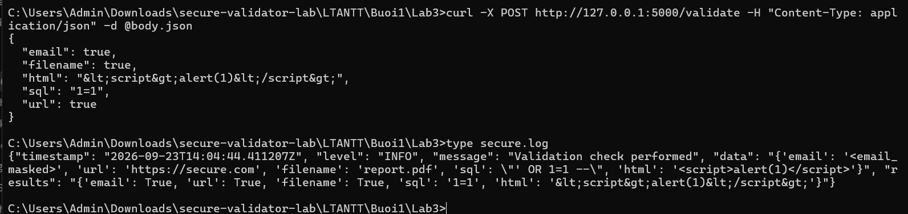

# SecureLogger — Hệ thống Ghi nhật ký Ưu tiên Bảo mật

> Bài thực hành 1.6 — Ghi nhật ký ưu tiên bảo mật
> Môn: Lập trình an ninh thông tin (UEF)
> Sinh viên: **Lê Viết Huy** — MSSV **2387700020** — Lớp **23DATA1**

## 1. Mục tiêu

Xây dựng hệ thống ghi nhật ký (**SecureLogger**) an toàn, tích hợp với thư viện **SecureValidator** (bài trước) qua ứng dụng Flask, để ghi lại tất cả các lần kiểm tra validation một cách an toàn.

## 2. Chức năng

| Chức năng | Mô tả | Thành phần |
|-----------|-------|-----------|
| Log đa cấp độ | DEBUG / INFO / WARNING / ERROR / CRITICAL | `get_secure_logger` |
| Định dạng JSON | Mỗi dòng log là một JSON object | `JSONFormatter` |
| Che PII | Tự động che email, token, password... | `mask_pii` |
| Chống sửa log | Ký băm SHA-256 từng dòng ra `secure.log.sig` | `hash_line`, `append_signature` |
| Xoay & nén log | Vượt kích thước thì xoay, nén gzip | `GZipRotator`, `SecureRotatingFileHandler` |
| Tích hợp validation | Endpoint `POST /validate` gọi SecureValidator và log kết quả | `app.py` |

## 3. Cấu trúc thư mục

```
secure_logger_lab/
├── app.py                    # Flask: POST /validate
├── requirements.txt          # Flask
├── .gitignore
├── README.md
├── securevalidator/          # copy từ secure-validator-lab (bài trước)
│   ├── __init__.py
│   └── core.py
└── securelogger/
    ├── __init__.py
    └── logger.py             # SecureLogger core
```

## 4. Cài đặt & chạy

```bash
pip install -r requirements.txt
python app.py                 # http://127.0.0.1:5000
```

Gửi request thử — payload để sẵn trong `body.json` (dùng `-d @body.json` để tránh lỗi ký tự `<>` trên Windows CMD):

```bash
curl -X POST http://127.0.0.1:5000/validate -H "Content-Type: application/json" -d @body.json
```

## 5. Kết quả kiểm chứng

**Response JSON:**

```json
{ "email": true, "filename": true, "html": "&lt;script&gt;alert(1)&lt;/script&gt;", "sql": "1=1", "url": true }
```

**`secure.log`** — email đã bị che (`<email_masked>`), toàn bộ ghi dạng JSON:

```json
{"timestamp": "2026-09-23T...Z", "level": "INFO", "message": "Validation check performed",
 "data": "{'email': '<email_masked>', 'url': 'https://secure.com', 'filename': 'report.pdf', 'sql': \"' OR 1=1 --\", 'html': '<script>alert(1)</script>'}",
 "results": "{'email': True, 'sql': '1=1', 'html': '&lt;script&gt;alert(1)&lt;/script&gt;'}"}
```

**`secure.log.sig`** — hash SHA-256 của dòng log, dùng để xác thực log có bị thay đổi hay không:

```
d5561ccc499408bd7bae7c9c120c6f1890fcb3eff6ec6ac4ed4504a79b8accf1
```

## 6. Bằng chứng chạy thực tế

Gửi `POST /validate` (dùng `curl -d @body.json`) rồi xem `secure.log`:



Nhận xét:
- **Response**: `email/url/filename: true`, `sql: "1=1"` (đã lọc), `html: "&lt;script&gt;alert(1)&lt;/script&gt;"` (đã escape).
- **secure.log**: ghi JSON, trường `email` trong `data` đã bị che thành `<email_masked>` → **mask PII hoạt động đúng**. Chữ ký băm được lưu song song trong `secure.log.sig`.

## 7. Cách hoạt động (tóm tắt luồng)

1. `app.py` nhận POST `/validate`, gọi các hàm của SecureValidator.
2. Gọi `secure_logger.info(..., extra={"data":..., "results":...})`.
3. `JSONFormatter.format` chạy `mask_pii` để che PII rồi dựng JSON.
4. `SecureRotatingFileHandler.emit` ghi log **và** gọi `append_signature` để lưu hash dòng log.
5. Khi log vượt `MAX_LOG_SIZE`, `GZipRotator` nén file cũ thành `.gz`.

## 8. Ghi chú kỹ thuật

- `datetime.utcnow()` giữ đúng theo giáo trình. Trên Python 3.12+ có cảnh báo *deprecation*
  (vẫn chạy bình thường). Nếu muốn hết cảnh báo: đổi sang `datetime.now(timezone.utc)`.
- `append_signature` ghi đúng như giáo trình: `f.write(hash_line(line))` — **không** xuống dòng,
  nên các hash nối liền nhau trong `secure.log.sig` (mỗi hash dài 64 ký tự hex, có thể tách theo độ dài).
- `app.run(debug=True)` chỉ dùng cho môi trường học/dev, **không** dùng production.
- Các file sinh khi chạy (`secure.log`, `secure.log.sig`, `*.gz`) đã được đưa vào `.gitignore`.
