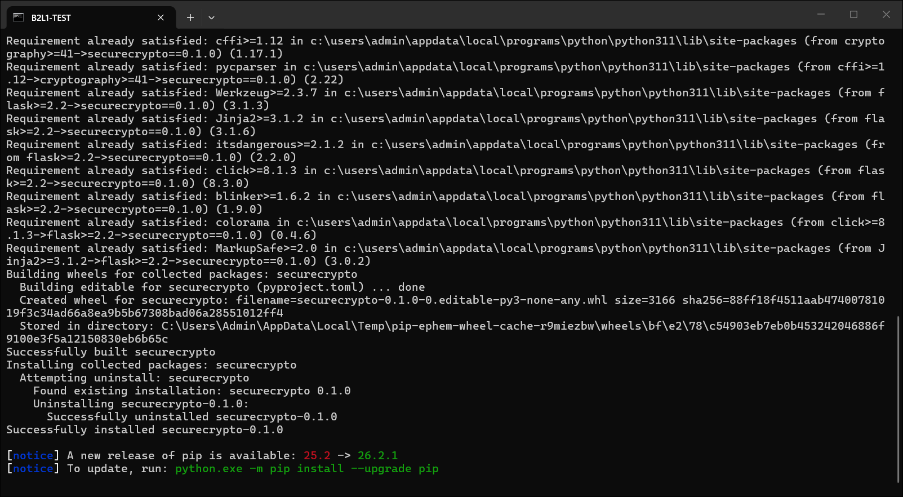
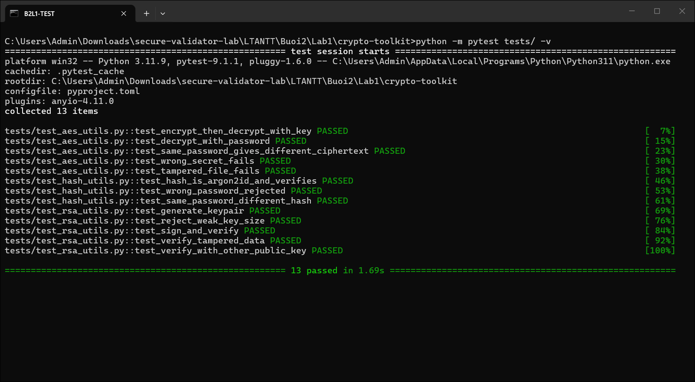
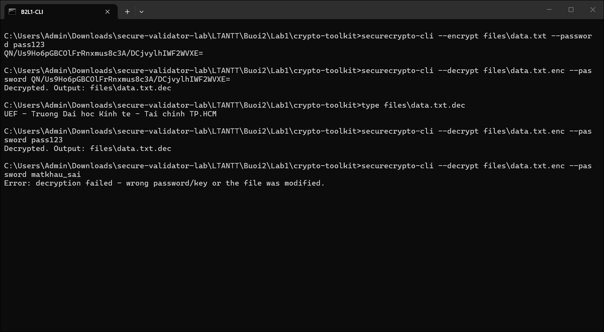
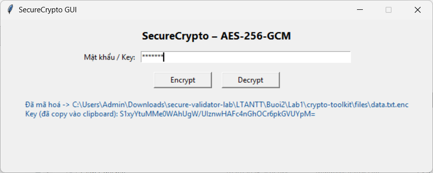
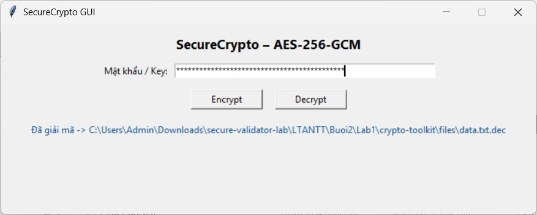
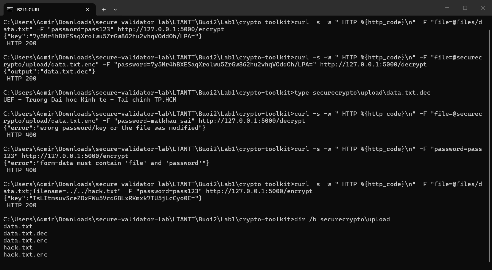
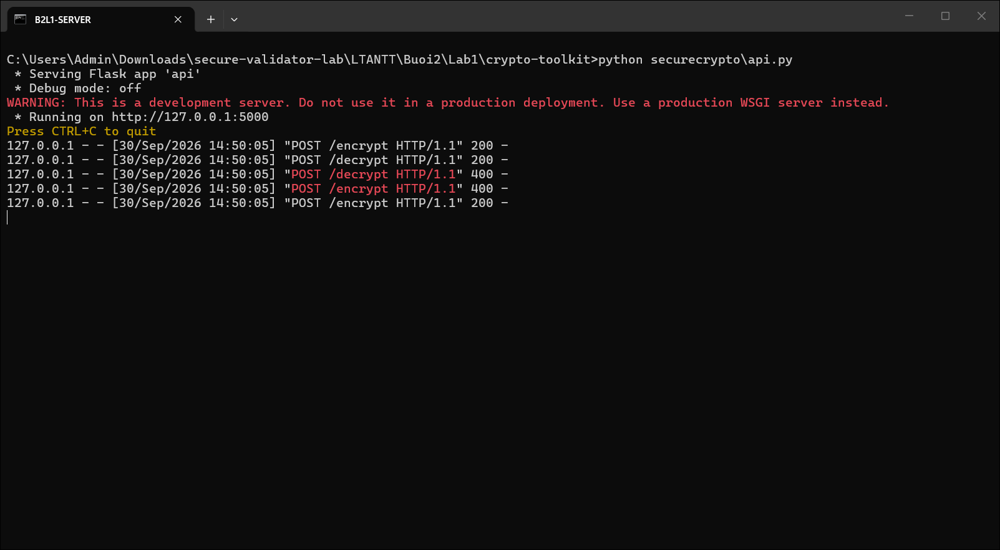

# Lab 1 – Thư viện mật mã CryptoToolkit (`securecrypto`)

> Buổi 2 — Thực hành mục 2.2: Xây dựng thư viện mật mã
> Môn: Lập trình an ninh thông tin (UEF)
> Sinh viên: **Lê Viết Huy** — MSSV **2387700020** — Lớp **23DATA1**

---

## 1. Mục tiêu

Xây dựng thư viện mật mã `securecrypto` (mã hoá file, chữ ký số, băm mật khẩu) và dùng nó qua 3 giao diện:
dòng lệnh (CLI), cửa sổ Tkinter (GUI) và REST API (Flask).

| Yêu cầu (2.2.1) | File | Cách làm |
|---|---|---|
| `encrypt_file_aes(filepath, password)` | `aes_utils.py` | PBKDF2-HMAC-SHA256 (100 000 vòng, salt ngẫu nhiên 16 byte) dẫn xuất khoá 32 byte → **AES-256-GCM**, nonce ngẫu nhiên 12 byte. File `.enc` = `salt ‖ nonce ‖ ciphertext + tag`. Trả về Key (base64) |
| `decrypt_file_aes(encrypted_file, password)` | `aes_utils.py` | Nhận **mật khẩu** hoặc **Key base64**, ghi ra `<tên>.dec`. Sai mật khẩu/Key hoặc file bị sửa → ném `InvalidTag`, không ghi file |
| `generate_rsa_keypair(key_size)` | `rsa_utils.py` | RSA, e = 65537, mặc định 2048 bit, **từ chối** khoá < 2048 bit |
| `sign_data_rsa(data, private_key)` | `rsa_utils.py` | **RSA-PSS** + SHA-256 |
| `verify_signature_rsa(data, signature, public_key)` | `rsa_utils.py` | Trả `True` / `False` |
| `hash_password_secure(password)` | `hash_utils.py` | **Argon2id** (`argon2-cffi`), kèm `verify_password()` để kiểm tra |

## 2. Cấu trúc thư mục

```
Lab1/
├── README.md
├── images/                     ảnh chụp kết quả
└── crypto-toolkit/
    ├── files/data.txt          file mẫu để mã hoá
    ├── securecrypto/
    │   ├── __init__.py
    │   ├── aes_utils.py        AES-256-GCM + PBKDF2
    │   ├── rsa_utils.py        RSA-PSS
    │   ├── hash_utils.py       Argon2id
    │   ├── cli.py              lệnh securecrypto-cli
    │   ├── app_gui.py          giao diện Tkinter
    │   └── api.py              Flask API: POST /encrypt, POST /decrypt
    ├── tests/
    │   ├── test_aes_utils.py   5 test
    │   ├── test_hash_utils.py  3 test
    │   └── test_rsa_utils.py   5 test
    ├── pyproject.toml
    ├── setup.py                khai báo gói + lệnh securecrypto-cli
    └── requirements.txt
```

## 3. Vì sao chọn các thuật toán này

- **AES-GCM thay vì AES-CBC**: GCM là mã hoá có xác thực (AEAD) — ngoài bí mật còn đảm bảo toàn vẹn. Chỉ cần
  sửa 1 bit của file `.enc` là giải mã báo `InvalidTag` (test `test_tampered_file_fails`). CBC không kèm MAC
  thì có thể bị lật bit (bit-flipping) hoặc padding-oracle mà không bị phát hiện.
- **Salt + nonce ngẫu nhiên mỗi lần mã hoá**: cùng một file, cùng một mật khẩu, mã hoá 2 lần vẫn ra 2 Key và 2 bản mã
  khác nhau (test `test_same_password_gives_different_ciphertext`). Không bao giờ dùng lại nonce với cùng khoá GCM,
  vì dùng lại sẽ lộ XOR của 2 bản rõ và cho phép giả mạo tag.
- **PBKDF2 100 000 vòng**: làm chậm việc dò mật khẩu. Đây là con số theo giáo trình; OWASP hiện khuyến nghị
  600 000 vòng cho PBKDF2-HMAC-SHA256 (xem mục 8).
- **RSA-PSS thay vì PKCS#1 v1.5**: PSS có yếu tố ngẫu nhiên và được chứng minh an toàn, là padding ký số được
  RFC 8017 khuyến nghị cho ứng dụng mới. Khoá tối thiểu 2048 bit theo NIST SP 800-57.
- **Argon2id cho mật khẩu**: thuật toán thắng Password Hashing Competition, tốn RAM có chủ đích (64 MiB mặc định) để
  chống brute-force bằng GPU/ASIC; salt ngẫu nhiên và tham số được lưu ngay trong chuỗi băm `$argon2id$v=19$m=...`.

## 4. Cài đặt và chạy unit test

```bash
cd Buoi2/Lab1/crypto-toolkit
python -m pip install -r requirements.txt
python -m pip install -e .
python -m pytest tests/ -v
```

`pip install -e .` cài gói `securecrypto` ở chế độ editable (sửa code không cần cài lại) và tạo lệnh
`securecrypto-cli`.



Kết quả: **13 passed**.



| Nhóm test | Kiểm tra điều gì |
|---|---|
| AES (5) | mã hoá → giải mã bằng Key; giải mã bằng mật khẩu; cùng mật khẩu ra bản mã khác nhau; sai mật khẩu → `InvalidTag` và không sinh file `.dec`; sửa 1 bit bản mã → `InvalidTag` |
| Argon2 (3) | chuỗi băm là `$argon2id$` và không chứa mật khẩu; sai mật khẩu → `False`; cùng mật khẩu băm 2 lần ra 2 chuỗi khác nhau (có salt) |
| RSA (5) | sinh khoá đúng kích thước và e = 65537; từ chối khoá 1024 bit; ký → xác thực `True`; dữ liệu bị sửa → `False`; khoá công khai khác → `False` |

Mật khẩu trong test được sinh ngẫu nhiên bằng `secrets.token_urlsafe()`, không viết cứng trong code (tránh bị hook
GitSecure của Buổi 1 chặn commit).

## 5. CLI

```bash
securecrypto-cli --encrypt files\data.txt --password pass123
securecrypto-cli --decrypt files\data.txt.enc --password <Key vừa in ra>
type files\data.txt.dec
securecrypto-cli --decrypt files\data.txt.enc --password pass123
securecrypto-cli --decrypt files\data.txt.enc --password matkhau_sai
```



- `--encrypt` in ra Key base64 và tạo `files\data.txt.enc`.
- `--decrypt` dùng Key đó (hoặc chính mật khẩu `pass123`) → `Decrypted. Output: files\data.txt.dec`, nội dung
  giống hệt file gốc.
- Sai mật khẩu → `Error: decryption failed - wrong password/key or the file was modified.`, thoát mã 1, không
  tạo file `.dec`.

Nếu báo `securecrypto-cli is not recognized` (thư mục `Scripts` của Python chưa có trong PATH) thì chạy
`python -m securecrypto.cli --encrypt ...` thay thế.

## 6. GUI (Tkinter)

```bash
python securecrypto\app_gui.py
```

1. Nhập mật khẩu `pass123` → bấm **Encrypt** → chọn `files\data.txt`. Cửa sổ hiện đường dẫn file `.enc` và Key;
   Key được copy sẵn vào clipboard.

   

2. Xoá ô mật khẩu, dán Key (Ctrl+V) → bấm **Decrypt** → chọn `files\data.txt.enc` → hiện đường dẫn file `.dec`.
   Sai Key/mật khẩu sẽ hiện hộp thoại lỗi.

   

## 7. Flask API

Chạy server (chỉ lắng nghe `127.0.0.1:5000`, debug tắt):

```bash
python securecrypto\api.py
```

Gửi request dạng **form-data** (dùng `curl` trên Windows; Postman chọn Body → form-data cũng được):

```bash
curl -F "file=@files/data.txt" -F "password=pass123" http://127.0.0.1:5000/encrypt
curl -F "file=@securecrypto/upload/data.txt.enc" -F "password=<Key>" http://127.0.0.1:5000/decrypt
```



| Request | Kết quả | Ý nghĩa |
|---|---|---|
| `POST /encrypt` file `data.txt`, `pass123` | `200 {"key": "..."}` | mã hoá thành công |
| `POST /decrypt` file `data.txt.enc`, Key ở trên | `200 {"output": "data.txt.dec"}` | giải mã đúng nội dung gốc |
| `POST /decrypt` với mật khẩu sai | `400 {"error": "wrong password/key ..."}` | GCM phát hiện sai khoá |
| `POST /encrypt` thiếu `file` | `400 {"error": "form-data must contain ..."}` | kiểm tra đầu vào |
| `POST /encrypt` tên file `../../hack.txt` | `200`, file lưu thành `upload/hack.txt` | **chặn path traversal** |

Log phía server:



Các điểm bảo mật trong `api.py`:
- `secure_filename()` bỏ `../`, `/`, `\` khỏi tên file upload → không ghi được ra ngoài thư mục `upload/`
  (test ở dòng cuối: `../../hack.txt` bị ép về `hack.txt`).
- `MAX_CONTENT_LENGTH = 10 MB` → chặn upload file quá lớn làm đầy RAM/ổ đĩa.
- Lỗi trả về JSON 400 ngắn gọn, không lộ stack trace; response chỉ trả tên file, không lộ đường dẫn tuyệt đối.
- `debug` tắt, chỉ bind `127.0.0.1`: debugger của Werkzeug cho phép chạy code Python ngay trên trang lỗi (chỉ
  được chặn bằng mã PIN), mở ra mạng là nguy cơ thực thi mã từ xa.

Thư mục `securecrypto/upload/`, các file `.enc` / `.dec` sinh ra khi chạy đã được đưa vào `.gitignore`.

## 8. Hạn chế và hướng cải thiện

| Hạn chế | Rủi ro | Cách khắc phục |
|---|---|---|
| Key trả về tương đương mật khẩu của file | Ai có Key là giải mã được | Coi Key là bí mật, không log / không gửi qua kênh không mã hoá |
| API chạy HTTP, không xác thực, không giới hạn tần suất | Nghe lén mật khẩu/Key; lạm dụng API | HTTPS (TLS), thêm xác thực (token), rate limit |
| File gốc (bản rõ) vẫn nằm trong `upload/` sau khi mã hoá | Lộ dữ liệu trên server | Xử lý trong thư mục tạm và xoá ngay sau khi trả kết quả |
| PBKDF2 mới 100 000 vòng | Dò mật khẩu yếu nhanh hơn | Tăng lên ≥ 600 000 vòng hoặc dùng Argon2id/scrypt làm KDF |
| `--password` gõ trên dòng lệnh | Lộ trong lịch sử shell / danh sách tiến trình | Hỏi mật khẩu bằng `getpass` |
| Đọc cả file vào RAM | File lớn gây tốn bộ nhớ | Mã hoá theo luồng (streaming) từng khối |
