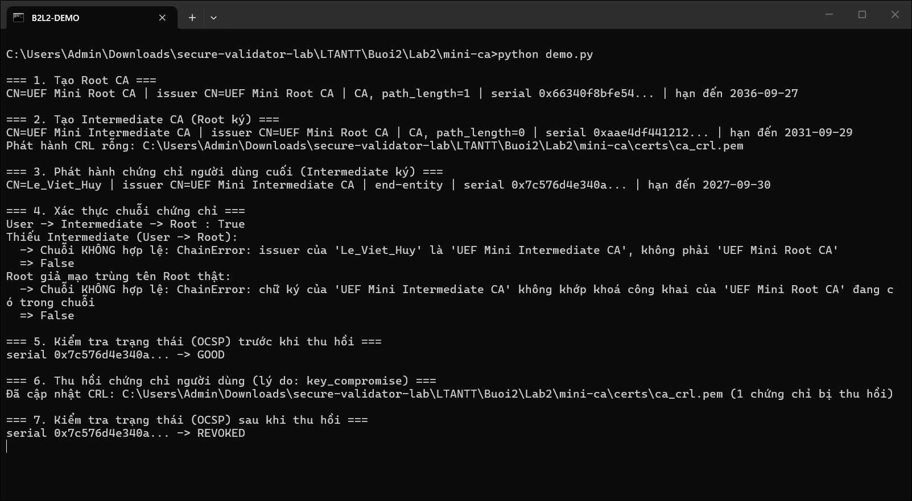
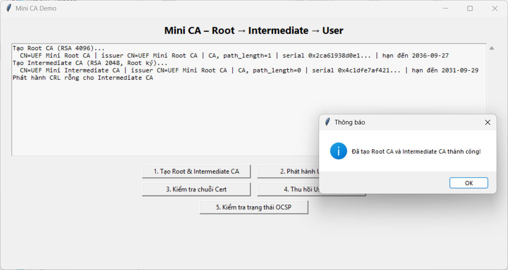
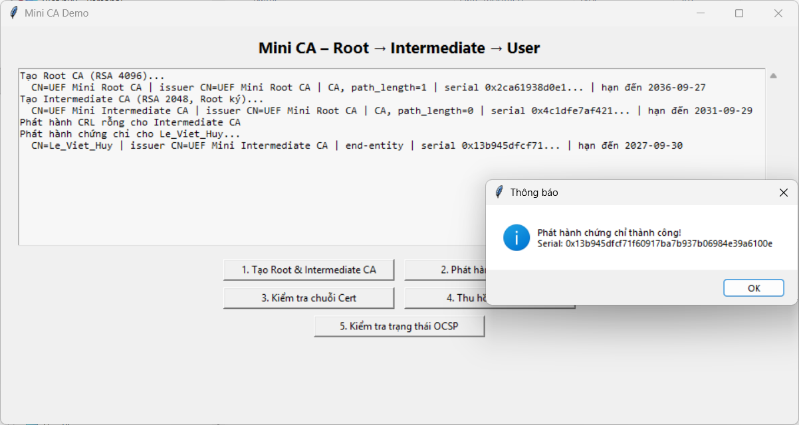
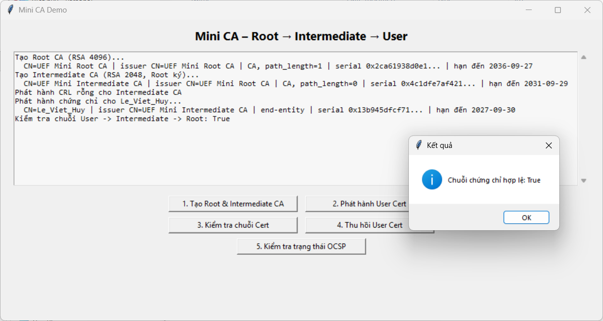
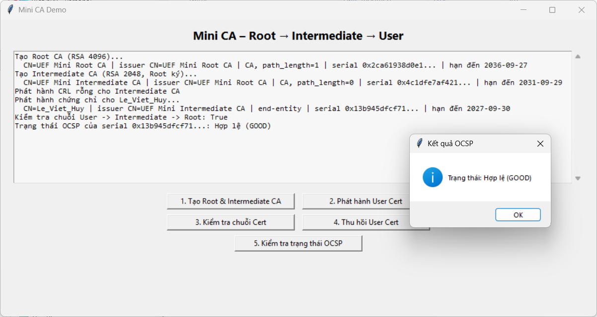
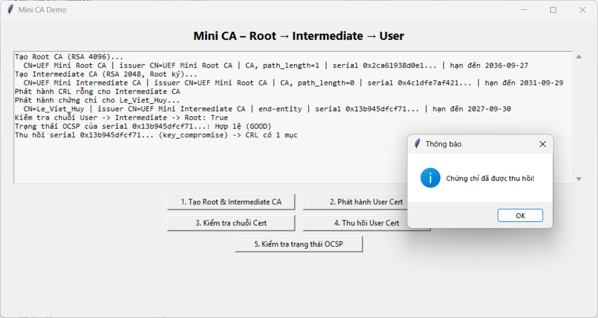
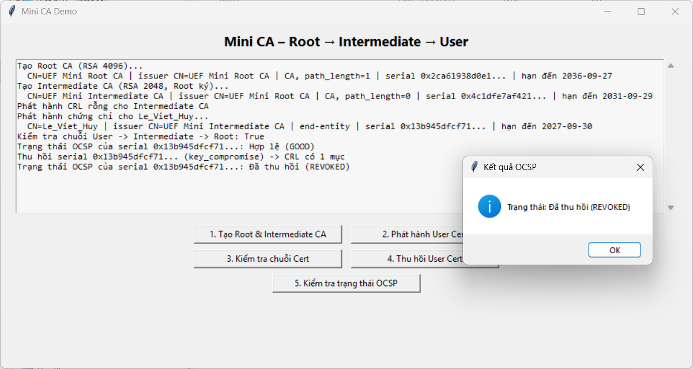

# Lab 2 – Certificate Authority (Mini CA)

> Buổi 2 — Thực hành mục 2.4: Xây dựng hệ thống CA đơn giản với chứng chỉ X.509
> Môn: Lập trình an ninh thông tin (UEF)
> Sinh viên: **Lê Viết Huy** — MSSV **2387700020** — Lớp **23DATA1**

---

## 1. Mục tiêu

Mô phỏng một hạ tầng khoá công khai (PKI) 3 cấp bằng thư viện `cryptography`: tạo CA, phát hành chứng chỉ,
xác thực chuỗi, thu hồi chứng chỉ và tra trạng thái.

```
UEF Mini Root CA          RSA 4096, tự ký, 10 năm, CA (path_length=1), KeyUsage: keyCertSign + cRLSign
  └── UEF Mini Intermediate CA   RSA 2048, Root ký, 5 năm, CA (path_length=0), keyCertSign + cRLSign
        └── Le_Viet_Huy           RSA 2048, Intermediate ký, 1 năm, KHÔNG phải CA
                                  KeyUsage: digitalSignature, nonRepudiation, keyEncipherment
                                  ExtendedKeyUsage: clientAuth, emailProtection
```

| Yêu cầu (2.4.1) | Hàm trong code |
|---|---|
| `create_root_ca()` – tạo Root CA | `ca_utils.create_root_ca()` → `(root_key, root_cert)` |
| `create_intermediate_ca(root_ca)` – tạo CA trung gian | `ca_utils.create_intermediate_ca(root_ca)`, với `root_ca = (key, cert)` |
| `issue_certificate(ca, subject_info)` – phát hành chứng chỉ | `ca_utils.issue_certificate(ca, subject_info)` |
| `verify_certificate_chain(cert, ca_chain)` – xác thực chuỗi | `ca_utils.verify_certificate_chain(cert, [intermediate, root])` |
| `revoke_certificate(cert_serial, reason)` – thu hồi | `revoke_utils.revoke_certificate(cert_serial, reason)`: thêm serial vào CRL `certs/ca_crl.pem`, ký lại bằng khoá Intermediate |
| `check_ocsp_status(cert_serial)` – kiểm tra trạng thái | `revoke_utils.check_ocsp_status(cert_serial)` → `GOOD` / `REVOKED` / `UNKNOWN` |

Tên hàm và tham số giữ **đúng như danh sách yêu cầu 2.4.1**. "OCSP" ở đây là mô phỏng: tra serial trong CRL
(sau khi đã kiểm chữ ký CRL), không có OCSP responder thật.

## 2. Cấu trúc thư mục

```
Lab2/
├── README.md
├── images/                ảnh chụp kết quả
└── mini-ca/
    ├── ca_utils.py        sinh khoá, tạo Root/Intermediate CA, phát hành, xác thực chuỗi
    ├── revoke_utils.py    CRL: tạo CRL rỗng, thu hồi, tra trạng thái (mô phỏng OCSP)
    ├── demo.py            chạy toàn bộ quy trình trên terminal
    ├── demo_ui.py         giao diện Tkinter 5 nút
    └── requirements.txt
```

Khi chạy sẽ sinh `mini-ca/certs/`: `root_ca_key.pem`, `root_ca_cert.pem`, `intermediate_key.pem`,
`intermediate_cert.pem`, `Le_Viet_Huy_key.pem`, `Le_Viet_Huy_cert.pem`, `ca_crl.pem`. Khoá riêng lưu **không mã hoá**
nên `certs/` và `*.pem` đã được đưa vào `.gitignore` ở gốc repo — không bao giờ commit khoá riêng lên GitHub.

## 3. `verify_certificate_chain` kiểm tra những gì

Chỉ kiểm chữ ký là chưa đủ. Với mỗi mắt xích (con → CA cấp trên) hàm kiểm tra:

1. Chứng chỉ con **còn hạn** (`not_valid_before ≤ now ≤ not_valid_after`).
2. `issuer` của con **trùng** `subject` của CA cấp trên.
3. CA cấp trên có `BasicConstraints ca=True` và **không vượt `path_length`** (Intermediate có `path_length=0`
   nên không được cấp tiếp một CA khác).
4. CA cấp trên có quyền **`keyCertSign`** trong KeyUsage.
5. **Chữ ký** của con được xác thực bằng khoá công khai của CA cấp trên (`verify_directly_issued_by`).

Cuối chuỗi phải là Root **tự ký** và còn hạn. Bất kỳ bước nào sai → trả `False` (in lý do nếu `verbose=True`).
Kiểm tra chuỗi không bao gồm thu hồi — giống thực tế, trạng thái thu hồi được tra riêng qua CRL/OCSP (mục 5).

## 4. Chạy demo trên terminal

```bash
cd Buoi2/Lab2/mini-ca
python -m pip install -r requirements.txt
python demo.py
```



| Bước | Kết quả | Nhận xét |
|---|---|---|
| 1–2. Tạo Root, Intermediate | in subject/issuer, `path_length`, serial, hạn dùng | Intermediate do Root ký; CA mới phát hành luôn một CRL rỗng |
| 3. Phát hành chứng chỉ `Le_Viet_Huy` | issuer = UEF Mini Intermediate CA, end-entity, hạn 1 năm | |
| 4. Chuỗi User → Intermediate → Root | `True` | |
| 4. Thiếu Intermediate (User → Root) | `False` — issuer của `Le_Viet_Huy` không phải Root | không bỏ qua được CA trung gian |
| 4. Root **giả mạo trùng tên** Root thật | `False` — chữ ký Intermediate không khớp khoá của Root giả | lý do phải kiểm **chữ ký**, không chỉ so tên |
| 5. OCSP trước khi thu hồi | `GOOD` | |
| 6. Thu hồi (lý do `key_compromise`) | CRL có 1 chứng chỉ bị thu hồi | CRL được ký lại bằng khoá Intermediate |
| 7. OCSP sau khi thu hồi | `REVOKED` | |

## 5. Chạy giao diện

```bash
python demo_ui.py
```

Bấm lần lượt:

1. **Tạo Root & Intermediate CA** → "Đã tạo Root CA và Intermediate CA thành công!"

   

2. **Phát hành User Cert** → "Phát hành chứng chỉ thành công!" kèm serial (bấm khi chưa tạo CA sẽ báo lỗi)

   

3. **Kiểm tra chuỗi Cert** → "Chuỗi chứng chỉ hợp lệ: True"

   

4. **Kiểm tra trạng thái OCSP** → "Trạng thái: Hợp lệ (GOOD)"

   

5. **Thu hồi User Cert** → "Chứng chỉ đã được thu hồi!"

   

6. **Kiểm tra trạng thái OCSP** lần nữa → "Trạng thái: Đã thu hồi (REVOKED)"

   

## 6. Kiểm tra chéo bằng OpenSSL (tuỳ chọn)

Chứng chỉ sinh ra theo đúng chuẩn X.509 nên OpenSSL xác thực được độc lập với code Python (máy đã cài
Git for Windows thường có sẵn `openssl.exe` trong `C:\Program Files\Git\usr\bin\`). Kết quả dưới đây chạy trên
chính bộ chứng chỉ của lần bấm GUI ở mục 5 — CRL liệt kê serial `13B945DFCF71...`, trùng serial trong ảnh bước 2,
lý do `Key Compromise`:

```bash
cd certs
openssl verify -CAfile root_ca_cert.pem -untrusted intermediate_cert.pem Le_Viet_Huy_cert.pem
# Le_Viet_Huy_cert.pem: OK

type root_ca_cert.pem intermediate_cert.pem > chain.pem
openssl verify -crl_check -CAfile chain.pem -CRLfile ca_crl.pem Le_Viet_Huy_cert.pem
# error 23 at 0 depth lookup: certificate revoked       (sau khi đã thu hồi)
```

## 7. Bảo mật và hạn chế

| Điểm | Cách làm trong lab | Thực tế nên làm |
|---|---|---|
| Khoá riêng của CA | PEM không mã hoá trong `certs/` (đã `.gitignore`) | Mã hoá bằng passphrase (`BestAvailableEncryption`) hoặc lưu trong HSM; Root CA để **offline** |
| Serial number | `x509.random_serial_number()` (~159 bit ngẫu nhiên) | Đúng yêu cầu CA/Browser Forum (≥ 64 bit ngẫu nhiên), chống tấn công va chạm |
| Tin cậy CRL | `check_ocsp_status` kiểm chữ ký và issuer của CRL; CRL giả hoặc quá hạn `nextUpdate` → `UNKNOWN` | Không coi `UNKNOWN` là hợp lệ |
| Tạo lại CA | CA mới phát hành CRL rỗng mới, CRL cũ (ký bởi CA cũ) không bị chép sang | Giữ lịch sử CRL theo từng CA |
| OCSP | Mô phỏng bằng tra CRL cục bộ | OCSP responder trả response có chữ ký, kèm nonce chống replay |
| Độ dài khoá | Root 4096 bit, Intermediate/User 2048 bit | Có thể dùng ECDSA P-256/P-384 cho chứng chỉ ngắn hạn |
