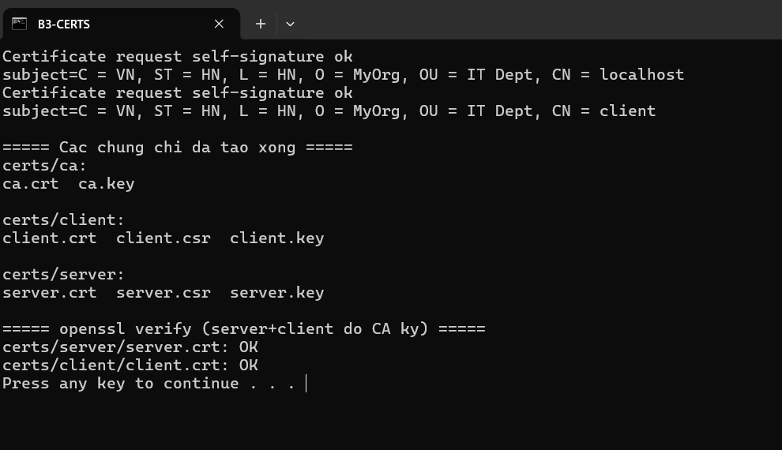
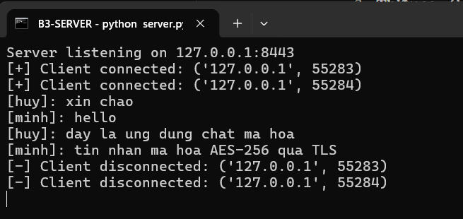
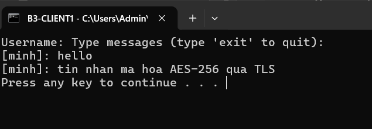
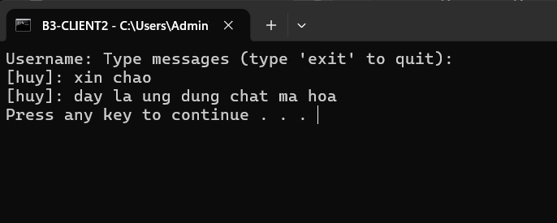
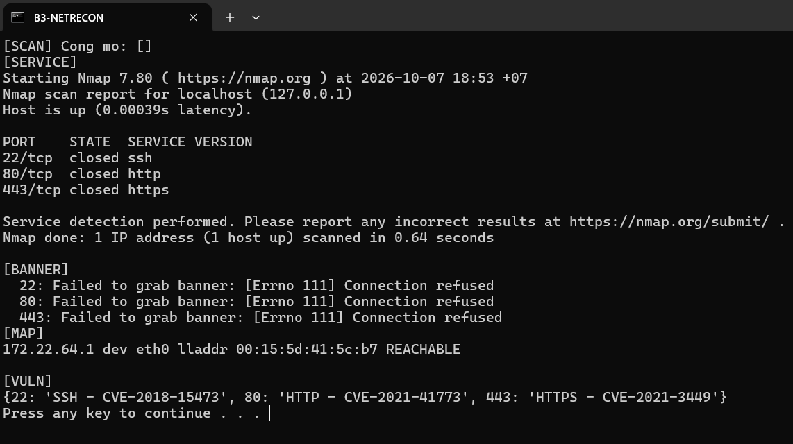
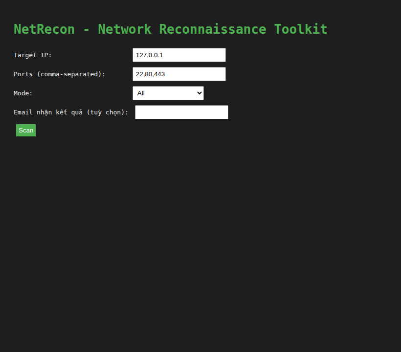
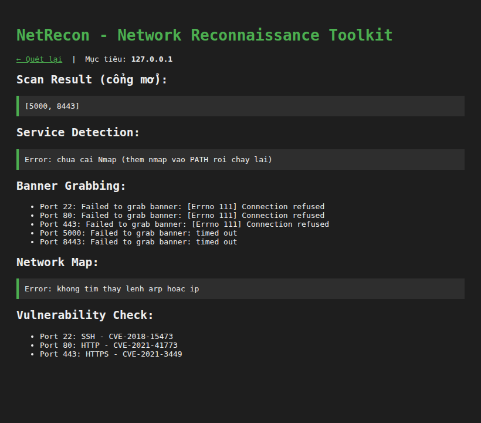

# Bài thực hành 3 – SecureChat (SSL/TLS) & Netrecon

Họ và tên: **Lê Viết Huy**
Lớp: **23DATA1**
MSSV: **2387700020**

---

## 1. Mục tiêu

- **SecureChat**: ứng dụng chat qua **SSL/TLS xác thực chứng chỉ hai chiều** (CA tự tạo), tin nhắn mã hoá đầu-cuối **AES-256**.
- **Netrecon**: bộ công cụ trinh sát mạng (quét cổng, nhận dạng dịch vụ, banner, sơ đồ mạng, tra CVE) có **CLI + web (Flask)** và gửi kết quả qua email.

**Ghi chú đạo đức:** mọi thao tác quét chỉ nhằm vào **máy của chính mình** (`127.0.0.1`). Các IP trong đề bài (`10.14.89.200`, `192.168.1.1`) được thay bằng `127.0.0.1`.

**Môi trường thực hiện:** Windows + **WSL (Ubuntu), OpenSSL, Nmap 7.80, Python 3**. SecureChat và Netrecon chạy thật, ảnh trong báo cáo là ảnh chụp cửa sổ thật.

## 2. Cơ sở lý thuyết

**SSL/TLS:** socket thường truyền dữ liệu dạng rõ nên dễ bị nghe lén và giả mạo. TLS khắc phục bằng cách: bắt tay (handshake) dùng mã hoá bất đối xứng để trao khoá phiên, sau đó mã hoá đối xứng toàn bộ dữ liệu trong phiên. Hai bên xuất trình **chứng chỉ số** do CA ký để xác minh danh tính, chống tấn công trung gian (MITM).

**Xác minh chứng chỉ:** kiểm tra chữ ký của CA trên chứng chỉ, truy chuỗi tin cậy lên Root CA, kiểm tra hạn dùng và khớp danh tính. Trong bài, một CA tự tạo ký cả chứng chỉ `server` (CN=localhost) lẫn `client` (CN=client); server đặt `ssl.CERT_REQUIRED` nên **bắt buộc client cũng phải có chứng chỉ do CA ký** — tức xác thực TLS hai chiều (mutual TLS).

**Quét cổng & nhận dạng dịch vụ:** quét cổng xác định trạng thái cổng (`open`/`closed`/`filtered`). Nhận dạng dịch vụ (service fingerprinting, vd `nmap -sV`) phân tích banner và phản hồi giao thức để suy ra phần mềm và phiên bản sau cổng.

---

## 3. Phần 1 – Tạo chứng chỉ (SSL/TLS)

File `openssl.cnf` cấu hình CA gốc (`CN=MyRootCA`, `basicConstraints = critical, CA:true`). Script `make-certs.bat` (hoặc `make_certs.py` nếu máy chưa cài OpenSSL) sinh:
- **CA tự ký** – RSA 2048, SHA-256, hạn 10 năm.
- **Server** (`CN=localhost`) và **Client** (`CN=client`) – do CA ký, hạn 1 năm.

Chạy xong, `openssl verify` xác nhận cả server và client đều do CA ký hợp lệ:

Thư mục `certs/` gồm 3 thư mục con `ca` (ca.crt, ca.key), `server` (server.crt, server.csr, server.key), `client` (client.crt, client.csr, client.key). Khoá riêng được lưu **không mã hoá** nên `certs/` và `*.pem` đã nằm trong `.gitignore` — không đẩy khoá riêng lên GitHub.

---

## 4. Phần 2 – SecureChat

### 4.1 Cấu trúc và vai trò

| File | Vai trò |
|---|---|
| `message_encryption.py` | mã hoá đầu-cuối từng tin: AES-256-CBC + PKCS7, IV ngẫu nhiên mỗi tin |
| `connection_manager.py` | quản lý client (socket → username, khoá AES), khoá `threading.Lock` an toàn đa luồng |
| `room_manager.py` | quản lý phòng chat, broadcast theo phòng |
| `server.py` | server SSL/TLS đa luồng cổng **8443**, `CERT_REQUIRED` (xác thực client) |
| `client.py` | nạp CA để xác minh server, nạp cert/key client để server xác minh lại, gửi `username:khoá_AES`, thread nhận/giải mã |

### 4.2 Chạy thử: 1 server + 2 client

Mở 3 cửa sổ: `python server.py`, rồi 2 `python client.py` (đăng nhập, nhắn tin).

Server nhận kết nối của cả 2 client và log toàn bộ hội thoại:

Client 1 (`huy`) nhận được tin của client 2 (`minh`) sau khi giải mã:

Client 2 (`minh`) nhận được tin của client 1 (`huy`):

### 4.3 Nhận xét

- Phiên chạy trên **TLS**, client xác minh server qua CA (server có `CN=localhost`); server đặt `CERT_REQUIRED` nên client **không có chứng chỉ do CA ký sẽ bị từ chối handshake** — đúng mô hình xác thực hai chiều.
- Mỗi client sinh **khoá AES-256 riêng**. Server giải mã tin đến rồi **mã hoá lại bằng khoá của từng người nhận** trước khi chuyển tiếp, nên tin tới đúng dạng `[tên]: nội dung` ở phía nhận → chứng tỏ mã hoá đầu-cuối AES-256 hoạt động trên nền kênh TLS. Hai client thấy tin của nhau khớp với log phía server.

### 4.4 Khác biệt so với code mẫu (nêu để minh bạch)

- Dùng `context.minimum_version = TLSv1_2` thay cho cặp cờ `OP_NO_TLSv1 | OP_NO_TLSv1_1` đã bị *deprecated* ở Python 3.10+ (cùng tác dụng: ép TLS ≥ 1.2, nhưng không còn `DeprecationWarning`).
- Thêm `SO_REUSEADDR` cho server để khởi động lại không vướng cổng còn ở TIME_WAIT; bổ sung `make_certs.py` sinh chứng chỉ khi máy chưa cài OpenSSL.

---

## 5. Phần 3 – Netrecon

### 5.1 Cấu trúc và vai trò module

| Module | Vai trò |
|---|---|
| `port_scanner.py` | quét cổng TCP bằng `asyncio`, giới hạn tốc độ bằng `asyncio.Semaphore` (rate limiting) |
| `service_detector.py` | nhận dạng phiên bản dịch vụ qua `nmap -sV` |
| `banner_grabber.py` | lấy banner dịch vụ qua socket, có timeout |
| `network_mapper.py` | bảng ARP / `ip neigh` – liệt kê host trong mạng (sơ đồ mạng) |
| `vuln_checker.py` | tra CVE cơ bản theo cổng (21/22/23/80/443) |
| `filter_utils.py` | lọc mục tiêu theo whitelist / blacklist |
| `email_sender.py` | gửi kết quả qua Gmail SMTP (SMTP_SSL cổng 465) |

Mọi hoạt động được ghi log kèm **timestamp** vào `netrecon.log`.

### 5.2 Kiểm thử CLI

`python cli.py --target 127.0.0.1 --ports 22,80,443 --mode all` (mode: `scan/service/banner/map/vuln/all`).

Kết quả chạy thật: `nmap -sV` (Nmap 7.80) trả bảng `PORT STATE SERVICE VERSION`; `MAP` liệt kê gateway kèm địa chỉ MAC; `VULN` tra CVE theo cổng:

### 5.3 Giao diện web (Flask)

Chạy `python app.py`, mở `http://127.0.0.1:5000/`, nhập Target/Ports/Mode/Email rồi **Scan**:

Trang kết quả hiển thị cổng mở, banner và CVE theo cổng:

*(Ảnh web ở trên chụp khi chạy trong môi trường không có sẵn `nmap`/`arp` nên hai mục Service/Map báo thiếu công cụ; trên máy có Nmap thì hai mục này cho dữ liệu thật như ảnh CLI mục 5.2. Mục SCAN trả về danh sách cổng mở — xem cải tiến ở 5.5.)*

### 5.4 Gửi email

`app.py` gom kết quả thành thân thư rồi gọi `email_sender.send_email(...)` qua **Gmail SMTP_SSL cổng 465**, dùng `SMTP_USER`/`SMTP_PASS` đọc từ `.env`. `SMTP_PASS` là **mật khẩu ứng dụng 16 ký tự** của Google (cần bật xác thực 2 bước), **không phải** mật khẩu đăng nhập Gmail.

> Để gửi thật: tạo mật khẩu ứng dụng tại `myaccount.google.com/apppasswords`, chép `.env.example` → `.env` rồi điền. File `.env` đã nằm trong `.gitignore`, không đẩy lên GitHub.

### 5.5 Ghi chú đề bài vs thực tế (nêu để minh bạch)

- `requirements.txt` của đề liệt kê `asyncio` (đã có sẵn trong Python ≥ 3.4) và `htmx` (thư viện JavaScript, gói Python cùng tên không được dùng). Bài này bỏ 2 gói thừa, chỉ giữ `flask, click, python-dotenv, cryptography`.
- Code đề `async_scan_ports` không `return` nên mục SCAN ở web/email hiện `None`; bài này cho hàm **trả về danh sách cổng mở** để kết quả hiển thị đầy đủ.
- `network_mapper` giữ `arp -a` (Windows) và **thêm fallback `ip neigh`** để chạy được cả trên Linux/WSL (Ubuntu không cài sẵn `net-tools`).
- `app.py` bind **`127.0.0.1`** thay vì `0.0.0.0` để công cụ quét không mở ra toàn mạng LAN.

## 6. Kết luận

- **SecureChat** đạt yêu cầu: kênh TLS xác thực chứng chỉ **hai chiều**, tin nhắn mã hoá **AES-256** đầu-cuối theo khoá riêng từng client, hỗ trợ nhiều client và phòng chat.
- **Netrecon** đạt yêu cầu: quét cổng (có rate limiting), nhận dạng dịch vụ (`nmap -sV`), banner grabbing, sơ đồ mạng, tra CVE cơ bản, whitelist/blacklist, ghi log có timestamp, có CLI + web và gửi email kết quả.
- Toàn bộ thử nghiệm giới hạn ở `127.0.0.1`.
